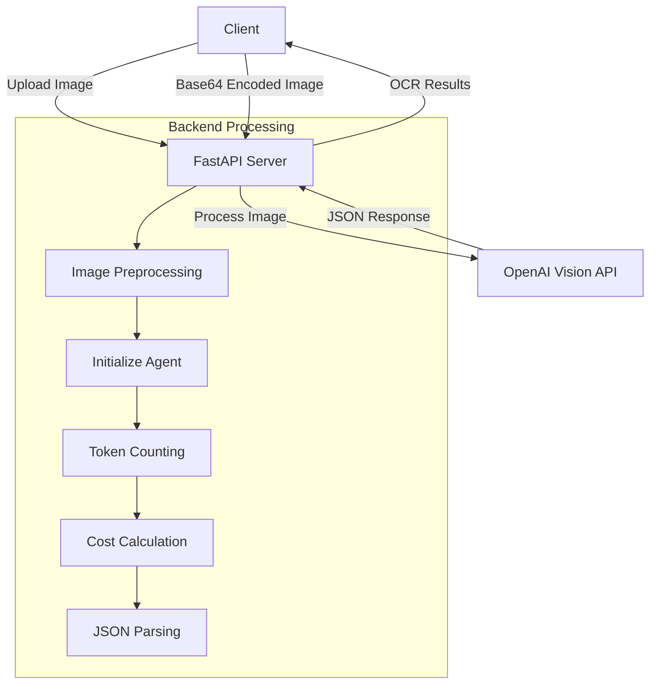

# Check-OCR-API
This API extracts information from bank check images using OpenAI's vision models. It provides a simple interface for processing check images and extracting key information like payee name, date, amount, and signature verification.

## Features

- Extract key information from bank check images:
  - Payee name
  - Date
  - Amount in words
  - Amount in digits
  - Signature verification
- Support for multiple OpenAI vision models
- Cost tracking for API usage
- Simple RESTful API interface
- File upload and base64 image support

## System Architecture



## API Endpoints

### Check OCR from File Upload

```
POST /ocr/check
```

Parameters:
- `file`: The image file to process
- `model`: The OpenAI model to use (default: gpt-4o-mini)

### Check OCR from Base64 Image

```
POST /ocr/check/base64
```

Parameters:
- `image`: Base64-encoded image string
- `model`: The OpenAI model to use (default: gpt-4o-mini)

### Health Check

```
GET /health
```

## Response Format

```json
{
  "chequeOcrResponse": {
    "name": "John Doe",
    "date": "2023-05-15",
    "amountInWords1": "One thousand",
    "amountInWords2": "five hundred only",
    "amount_digits": "1500.00",
    "signature": true
  },
  "cost_info": {
    "model": "gpt-4o-mini",
    "input_tokens": 250,
    "output_tokens": 100,
    "input_cost": 0.000038,
    "output_cost": 0.00006,
    "total_cost": 0.000098
  }
}
```

## Supported Models

- `gpt-4o`: High-quality vision model
- `gpt-4o-mini`: Cost-effective vision model
- `gpt-4-vision-preview`: Preview vision model
- `gpt-4`: Original GPT-4 model
- `gpt-3.5-turbo`: Fastest model option

## Model Pricing

| Model | Input Cost (per 1M tokens) | Output Cost (per 1M tokens) |
|-------|----------------------------|----------------------------|
| gpt-4o | $5.00 | $15.00 |
| gpt-4o-mini | $0.15 | $0.60 |
| gpt-4-vision-preview | $10.00 | $30.00 |
| gpt-4 | $30.00 | $60.00 |
| gpt-3.5-turbo | $0.50 | $1.50 |

## Getting Started

### Prerequisites

- Python 3.8+
- FastAPI
- OpenAI API key

### Installation

```bash
# Clone the repository
git clone https://github.com/faraz18001/check-ocr-api.git
cd check-ocr-api

# Install dependencies
pip install -r requirements.txt

# Set your OpenAI API key
export OPENAI_API_KEY="your_api_key_here"
```

### Running the Server

```bash
uvicorn test:app --reload --host 0.0.0.0 --port 8000
```

### Example Usage

#### Using cURL

```bash
# Upload a check image
curl -X POST -F "file=@/path/to/check.jpg" -F "model=gpt-4o-mini" http://localhost:8000/ocr/check

# Base64 encoded image
curl -X POST -H "Content-Type: application/json" \
  -d '{"image": "BASE64_ENCODED_IMAGE_HERE", "model": "gpt-4o-mini"}' \
  http://localhost:8000/ocr/check/base64
```

#### Using Python

```python
import requests
import base64

# File upload
with open('check.jpg', 'rb') as f:
    response = requests.post(
        'http://localhost:8000/ocr/check',
        files={'file': f},
        data={'model': 'gpt-4o-mini'}
    )
    print(response.json())

# Base64 encoded image
with open('check.jpg', 'rb') as f:
    img_base64 = base64.b64encode(f.read()).decode('utf-8')
    response = requests.post(
        'http://localhost:8000/ocr/check/base64',
        json={'image': img_base64, 'model': 'gpt-4o-mini'}
    )
    print(response.json())
```

## Security Considerations

- In production, replace the wildcard CORS policy with specific origins
- Secure your OpenAI API key using environment variables or a secrets manager
- Implement rate limiting to prevent abuse

## License

This project is licensed under the MIT License - see the LICENSE file for details.
